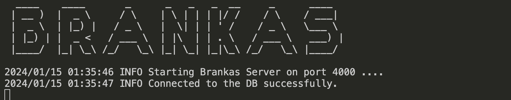
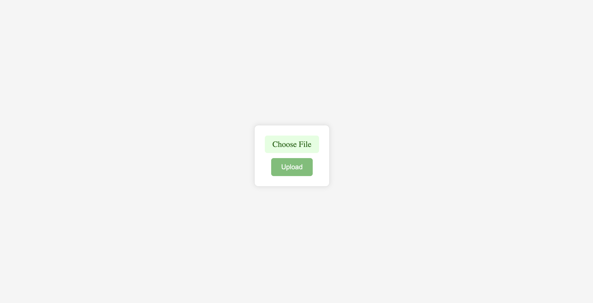
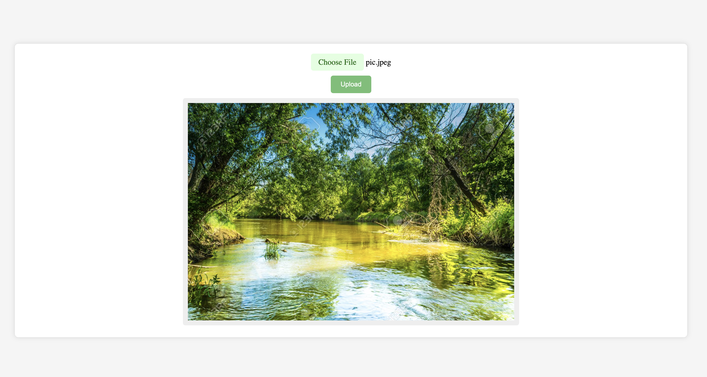
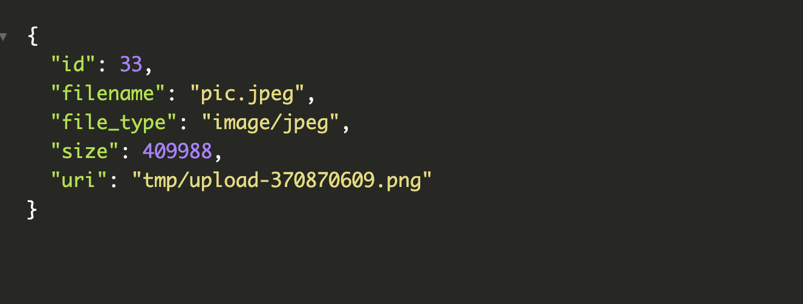
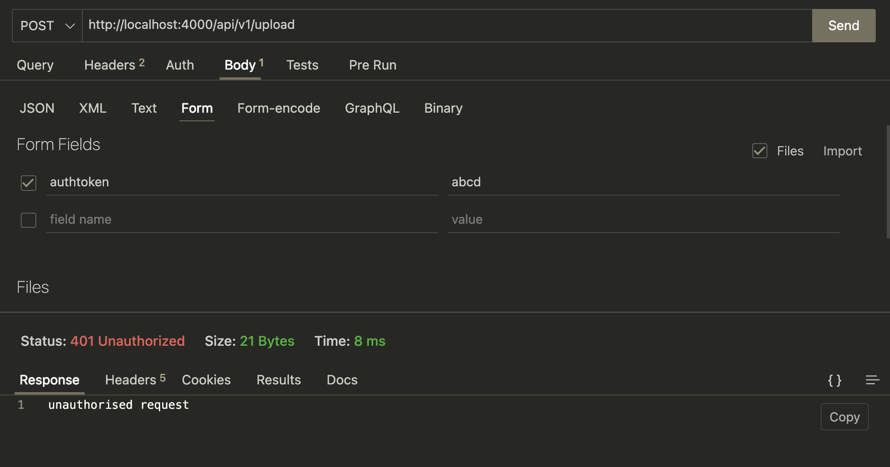
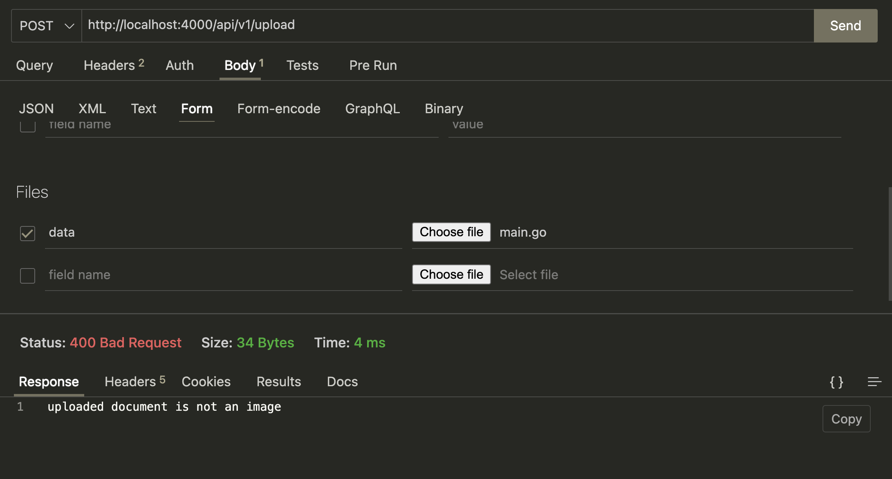
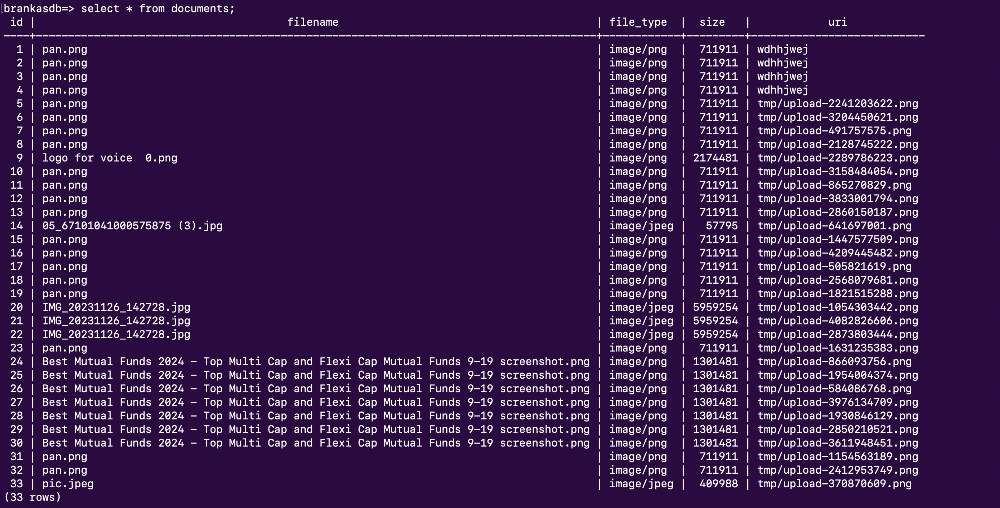
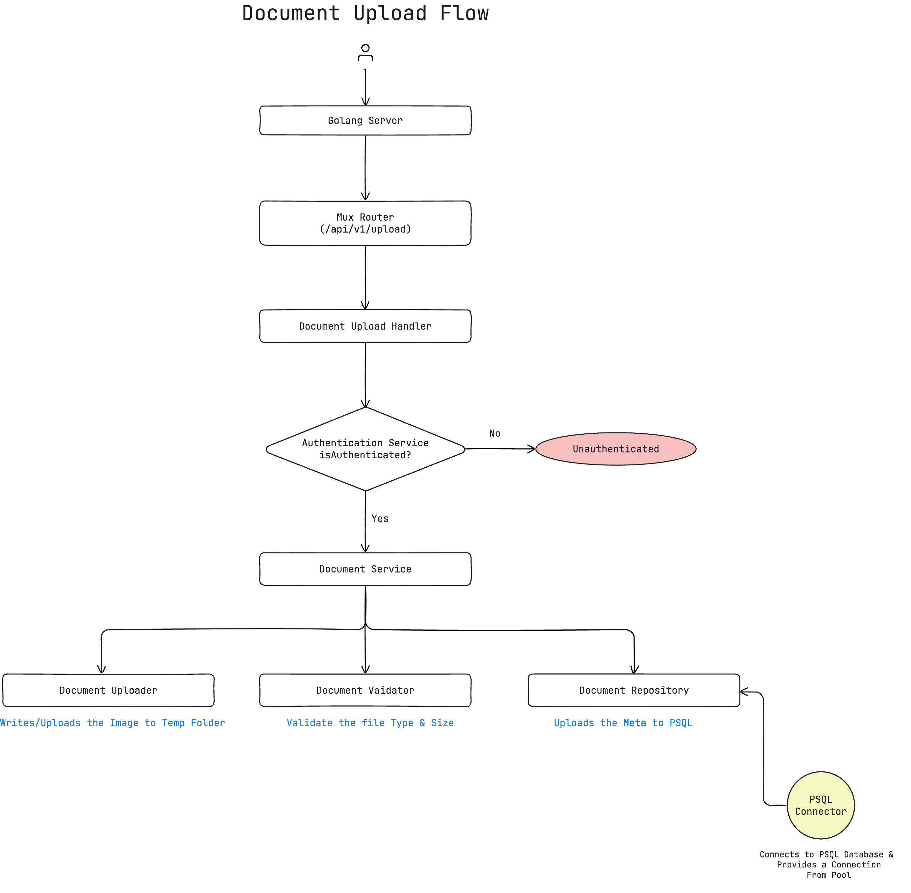

# Brankas Uploader

## APIs

1. /api/v1/upload -> Handle Upload logic
2. / -> Serves the Form
3. /api/v1/health_check -> Health Check API

## Running Project
Navigate inside the project and run.

`go run main.go ` 

- This will run the server on localhost:4000
- It will connected to a managed database in GCP Cloud SQL.

### Server StartUp

### Form 

### API Responses

200 OK Response

403 Response

400 Response

## Database 

Database Schema and Data 

## Project Structure
Project Enterypoint -> main.go

- api
    - v1 -> api version v1
        - handler -> Contains all the handlers for APIs
        - router -> Contains route Configuration for api version v1
    - v2
- models -> Contains all the types
    - model/Document.go 
- repository -> Files to handle Database Operations
    - repository/document_repository.go
- service -> Business Logics
    - service/authentication_service.go
    - service/document_service.go
- utils -> Contains the helper files which can be used across the application
    - utils/document_uploader.go
    - utils/document_validator.go
- configs -> Contains all the configs 
    - db -> Contains DB Configs and connectors
        - config/db/psqldb_connector.go
- view
    - Contains the html templates
- tmp
    - Stores the temp files
    - Uploaded images are also written in this file.

